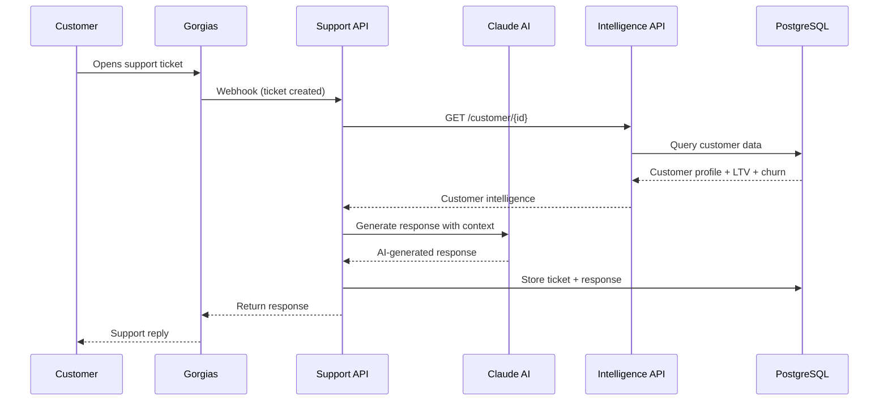
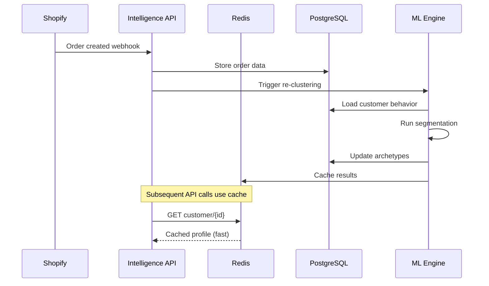

# Quimbi Platform - Deployment Architecture

## Railway Deployment Map

```mermaid
graph TB
    subgraph "GitHub Repository"
        REPO[q-monorepo<br/>scottatquimbi/q-monorepo]

        subgraph "Root Level"
            BACKEND[/backend/<br/>Intelligence API]
            RAILWAY_JSON[railway.json]
        end

        subgraph "Packages"
            SUPPORT[packages/support-backend/<br/>Support API]
            INTEL[packages/intelligence/<br/>Shared Logic]
            FRONTEND[packages/frontend/<br/>UI Components]
            SYNC[packages/azure-sync-cron/<br/>ETL Jobs]
        end
    end

    subgraph "Railway Projects"
        subgraph "patient-friendship"
            ECOM_SERVICE[Ecommerce-backend<br/>staging]
            ECOM_DOMAIN[ecommerce-backend-staging-a14c<br/>.up.railway.app]
        end

        subgraph "authentic-comfort"
            SUPPORT_SERVICE[QuimbiBrainBEv1.0<br/>production]
            SUPPORT_DOMAIN[quimbibrainbev10-production<br/>.up.railway.app]
        end
    end

    subgraph "External Services"
        SHOPIFY[Shopify API<br/>Customer & Order Data]
        GORGIAS[Gorgias Webhooks<br/>Support Tickets]
        CLAUDE[Anthropic Claude API<br/>AI Responses]
        AZURE_DB[Azure SQL<br/>Legacy Data]
    end

    subgraph "Railway Infrastructure"
        POSTGRES[(PostgreSQL<br/>Railway)]
        REDIS[(Redis<br/>Cache)]
    end

    %% Repository to Services
    BACKEND -->|Deploys to| ECOM_SERVICE
    SUPPORT -->|Deploys to| SUPPORT_SERVICE

    %% Service Dependencies
    INTEL -.->|Used by| BACKEND
    INTEL -.->|Used by| SUPPORT

    %% Domain mapping
    ECOM_SERVICE --> ECOM_DOMAIN
    SUPPORT_SERVICE --> SUPPORT_DOMAIN

    %% External integrations - Intelligence API
    SHOPIFY -->|Orders, Customers| ECOM_SERVICE
    ECOM_SERVICE -->|Reads/Writes| POSTGRES
    ECOM_SERVICE -->|Cache| REDIS
    AZURE_DB -->|Sync via| SYNC
    SYNC -->|Loads to| POSTGRES

    %% External integrations - Support API
    GORGIAS -->|Ticket Webhooks| SUPPORT_SERVICE
    SUPPORT_SERVICE -->|AI Generation| CLAUDE
    SUPPORT_SERVICE -->|Customer Intelligence| ECOM_DOMAIN
    SUPPORT_SERVICE -->|Ticket Data| POSTGRES

    %% Styling
    classDef railwayService fill:#7c3aed,stroke:#5b21b6,color:#fff
    classDef external fill:#0ea5e9,stroke:#0284c7,color:#fff
    classDef database fill:#059669,stroke:#047857,color:#fff
    classDef package fill:#f59e0b,stroke:#d97706,color:#000

    class ECOM_SERVICE,SUPPORT_SERVICE railwayService
    class SHOPIFY,GORGIAS,CLAUDE,AZURE_DB external
    class POSTGRES,REDIS database
    class INTEL,FRONTEND,SYNC package
```

## Service Details

### 1. Intelligence API (patient-friendship)
**Deployment Path**: `/backend/` → Railway
**Domain**: `ecommerce-backend-staging-a14c.up.railway.app`
**Purpose**: Customer behavioral intelligence & predictive analytics

**Responsibilities**:
- Customer segmentation (868 archetypes)
- Churn prediction & LTV analysis
- Shopify data integration
- ML clustering algorithms
- REST API for customer insights

**Dependencies**:
- PostgreSQL (customer data, orders, segments)
- Redis (caching)
- Shopify API (real-time data)
- Azure SQL → PostgreSQL sync (batch loads)
- `packages/intelligence/` (shared ML logic)

**Start Command**: `python -m uvicorn backend.main:app --host 0.0.0.0 --port $PORT`

---

### 2. Support Backend (authentic-comfort)
**Deployment Path**: `packages/support-backend/` → Railway
**Domain**: `quimbibrainbev10-production.up.railway.app`
**Purpose**: AI-powered customer support platform

**Responsibilities**:
- Gorgias webhook handling
- AI-generated support responses
- Customer context enrichment
- Ticket prioritization
- Support analytics

**Dependencies**:
- PostgreSQL (ticket data)
- Anthropic Claude API (AI responses)
- Intelligence API (customer insights via HTTP)
- Gorgias webhooks (inbound tickets)
- `packages/intelligence/` (shared logic)

**Start Command**: (Likely `uvicorn app.main:app` or similar)

---

### 3. Shared Packages (Not Deployed)

#### `packages/intelligence/`
- Shared ML models
- Behavioral segmentation logic
- Data transformations
- Used as library by both services

#### `packages/frontend/`
- Chat UI components
- Customer dashboard
- Deployed separately (static hosting)

#### `packages/azure-sync-cron/`
- ETL jobs (Azure SQL → PostgreSQL)
- Scheduled data sync
- Could be separate Railway cron service

---

## Data Flow

### Support Ticket Flow


### Customer Intelligence Flow


---

## Railway Projects Summary

| Project | Service | Environment | Domain | Deploys |
|---------|---------|-------------|--------|---------|
| **patient-friendship** | Ecommerce-backend | staging | `ecommerce-backend-staging-a14c.up.railway.app` | `/backend/` |
| **authentic-comfort** | QuimbiBrainBEv1.0 | production | `quimbibrainbev10-production.up.railway.app` | `packages/support-backend/` |

---

## Why Separate Deployments?

1. **Independent Scaling**: Support spikes don't affect intelligence API
2. **Release Independence**: Deploy support features without touching ML models
3. **Resource Isolation**: Different CPU/memory profiles
4. **Failure Isolation**: Support downtime doesn't break analytics
5. **Team Ownership**: Clear service boundaries
6. **Cost Optimization**: Scale only what needs scaling

---

## Future Considerations

### Potential Additional Railway Projects:
- **Azure Sync Cron**: Deploy `packages/azure-sync-cron/` as scheduled job
- **Frontend Hosting**: Static site deployment (or use Vercel/Cloudflare)
- **Production Intelligence API**: Separate prod environment from staging

### Service Communication:
- Currently: HTTP REST calls between services
- Consider: Internal Railway private networking
- Consider: Event-driven architecture (pub/sub) for async operations
