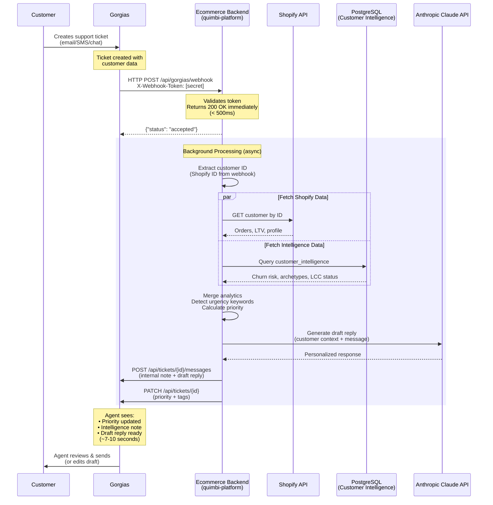

# Gorgias Integration Architecture - Complete Overview

## Executive Summary

The **quimbi-platform** repository (deployed as `ecommerce-backend-production-b9cc.up.railway.app`) provides an **AI-powered customer support enhancement** for Gorgias helpdesk. When a customer support ticket arrives in Gorgias, the system automatically:

1. Enriches the ticket with customer intelligence (LTV, churn risk, purchase history)
2. Detects urgency keywords and calculates priority
3. Generates AI-powered draft responses using Claude
4. Updates Gorgias with priority tags and internal notes
5. All in ~7-10 seconds

---

## Repository Overview

### **quimbi-platform** (`q-monorepo`)
- **GitHub**: `https://github.com/scottatquimbi/q-monorepo.git`
- **Local Path**: `/Users/scottallen/quimbi-platform/`
- **Railway Deployment**: `https://ecommerce-backend-production-b9cc.up.railway.app`
- **Purpose**: E-commerce customer intelligence + Gorgias AI assistant

### Key Components:
```
quimbi-platform/
├── backend/
│   ├── main.py                          # FastAPI app with Gorgias webhook endpoint
│   ├── api/routers/webhooks.py         # Webhook router (delegates to main.py)
│   ├── integrations/ticketing/         # Webhook verification utilities
│   ├── models/                         # Customer, order, intelligence models
│   ├── segmentation/                   # Behavioral clustering ML
│   └── ml/                            # Machine learning engines
├── integrations/
│   └── gorgias_ai_assistant.py         # Core Gorgias integration logic
├── mcp_server/
│   └── segmentation_server.py          # MCP tools for customer data
├── packages/
│   ├── support-backend/                # Separate support service (authentic-comfort)
│   ├── intelligence/                   # Shared ML/segmentation logic
│   └── frontend/                       # Chat UI components
└── docs/
    └── operations/
        ├── GORGIAS_PRODUCTION_WEBHOOK_SETUP.md
        └── HOW_TO_TEST_GORGIAS_BOT.md
```

---

## How Gorgias Uses This Backend

### Architecture Diagram



---

## Data Flow Breakdown

### 1. **Webhook Reception** (`backend/main.py:1983`)

**Endpoint**: `POST /api/gorgias/webhook`

**Authentication**:
- Custom header: `X-Webhook-Token` (matches `GORGIAS_WEBHOOK_SECRET` env var)
- No HMAC signature verification (uses simple token auth)

**Webhook Payload** (from Gorgias):
```json
{
  "id": "235766516",
  "customer": {
    "external_id": "7460267524351",  // Shopify customer ID
    "email": "customer@example.com",
    "name": "Jane Doe",
    "meta": {
      "shopify_customer_id": "7460267524351"
    },
    "integrations": {
      "shopify": {
        "customer": {
          "id": "7460267524351",
          "total_spent": "523.71",
          "orders_count": 12
        }
      }
    }
  },
  "messages": [
    {
      "body_text": "Where is my order?",
      "is_note": false,
      "created_datetime": "2025-11-12T10:00:00Z"
    }
  ],
  "via": "email",
  "tags": []
}
```

**Response** (immediate, < 500ms):
```json
{
  "status": "accepted",
  "ticket_id": "235766516",
  "message": "Webhook received and queued for processing"
}
```

---

### 2. **Async Background Processing** (`integrations/gorgias_ai_assistant.py`)

After returning 200 OK, the system processes in background using `asyncio.create_task()`:

#### **Step A: Extract Customer ID**

Priority order:
1. `customer.external_id` (Shopify customer ID)
2. `customer.meta.shopify_customer_id`
3. `customer.integrations.shopify.customer.id`
4. `customer.id` (Gorgias ID)
5. **Phone lookup** (for SMS tickets via Shopify API)
6. Email (fallback)

#### **Step B: Fetch Shopify Metrics** (from webhook)

Extracted from `customer.integrations.shopify`:
- Total spent (LTV)
- Order count
- Last order date
- Customer tags
- Accepts marketing

#### **Step C: Fetch Behavioral Intelligence** (from PostgreSQL)

Query `customer_intelligence` table:
- Churn probability (0-1 score)
- Behavioral archetype
- LCC membership status
- Segment data

#### **Step D: Merge Analytics**

Shopify data (PRIMARY) + Database intelligence (SUPPLEMENTAL):
```python
{
  "profile": {
    "business_metrics": {
      "lifetime_value": 523.71,  # From Shopify
      "total_orders": 12,         # From Shopify
      "avg_order_value": 43.64
    }
  },
  "churn": {
    "churn_probability": 0.23,    # From DB
    "risk_level": "LOW"
  },
  "is_lcc_member": true,          # From DB (Linda's Cupcake Club)
  "last_purchase_days": 45
}
```

#### **Step E: Urgency Detection**

Scans customer message for keywords:
- **CRITICAL**: "urgent", "immediately", "emergency", "ASAP"
- **HIGH**: "soon", "quickly", "waiting", "disappointed"
- **NORMAL**: default

#### **Step F: Priority Calculation**

Algorithm:
```python
if urgency == "CRITICAL":
    priority = "urgent"
elif is_lcc_member:
    priority = "high"
elif ltv > 500 or churn_risk > 0.7:
    priority = "high"
elif urgency == "HIGH":
    priority = "high"
else:
    priority = "normal"
```

Tags added:
- `lcc-member` (if applicable)
- `high-value` (LTV > $500)
- `churn-risk` (risk > 70%)
- `urgent-request` (urgency detected)

---

### 3. **AI Draft Generation** (Claude Haiku)

**Prompt Structure**:
```
You are a customer service agent for Linda's Electric Quilters.

CUSTOMER CONTEXT:
- Name: Jane Doe
- Email: customer@example.com
- LCC Member: Yes
- Lifetime Value: $523.71
- Total Orders: 12
- Churn Risk: 23% (LOW)
- Last Purchase: 45 days ago

CUSTOMER MESSAGE:
"Where is my order?"

URGENCY: NORMAL
PRIORITY: HIGH (LCC Member)

Generate a helpful, personalized response that:
1. Acknowledges LCC membership
2. Shows you reviewed their order history
3. Provides tracking/order status
4. Maintains friendly, professional tone
```

**Claude Response**:
```
Hi Jane,

Thank you for reaching out! As a valued Linda's Cupcake Club member,
I've pulled up your recent orders to help track this down.

I see you placed order #12345 on November 10th for the Rose Thread
bundle. Your order is currently in transit and should arrive by
November 15th.

Tracking: [link]

Would you like me to send you text updates when it arrives?

Best regards,
Linda's Customer Service Team
```

---

### 4. **Post to Gorgias**

**A. Internal Note** (visible to agents only):
```
🤖 Quimbi Customer Intelligence

📊 CUSTOMER ANALYTICS
💰 Lifetime Value: $523.71 (High Value)
🎯 LCC Member: Yes
⚠️  Churn Risk: 23% (LOW - Healthy)
📈 Historical: 12 orders, $44 avg order
📅 Last Purchase: 45 days ago

🚨 PRIORITY: HIGH
Reason: LCC Member + High Value Customer

🎯 RETENTION STRATEGY
• Risk Level: LOW
• Action: Standard response, acknowledge LCC status
• Next Best Action: Offer early access to new products
```

**B. Draft Reply** (suggested response):
```
[Claude-generated personalized response]
```

**C. Update Ticket**:
- Set priority: `high`
- Add tags: `lcc-member`, `high-value`

---

## Integration Points

### **This Backend Provides:**

1. **Customer Intelligence API**
   - LTV calculation
   - Churn prediction
   - Purchase history
   - Behavioral segmentation (868 archetypes)

2. **Gorgias Webhook Handler**
   - Async processing (prevents timeout)
   - Token authentication
   - Customer enrichment
   - Priority calculation

3. **AI Response Generation**
   - Claude Haiku integration
   - Context-aware drafts
   - Brand voice consistency

### **This Backend Consumes:**

1. **Shopify API**
   - Customer profiles
   - Order history
   - Product data
   - Tracking info

2. **Gorgias API**
   - Post internal notes
   - Create draft replies
   - Update ticket priority/tags

3. **PostgreSQL Database**
   - Customer intelligence table
   - Behavioral archetypes
   - Churn predictions
   - LCC membership data

---

## Relationship to Other Services

### **Does NOT Use:**

❌ **packages/support-backend/** (`authentic-comfort`)
- This is a SEPARATE Railway deployment
- Different purpose (different support backend)
- No direct integration with this Gorgias flow

### **Uses:**

✅ **Shopify Integration**
- Direct API calls to Shopify
- Customer lookup by ID/phone/email
- Order history retrieval

✅ **PostgreSQL** (Railway)
- Shared database with intelligence data
- Customer archetypes from ML clustering
- LCC membership flags

✅ **Redis Cache** (optional)
- Caches customer profiles
- Reduces database load
- 10-20x faster lookups

---

## Deployment Configuration

### **Railway Environment Variables**

```bash
# Gorgias Integration
GORGIAS_DOMAIN=lindas
GORGIAS_USERNAME=your-email@example.com
GORGIAS_API_KEY=base64_encoded_key
GORGIAS_WEBHOOK_SECRET=08130fe49bd19885a555cb81885dfc44...

# Shopify Integration
SHOPIFY_SHOP_NAME=lindas-electric-quilters
SHOPIFY_ACCESS_TOKEN=shpat_xxx
SHOPIFY_API_VERSION=2024-10

# AI
ANTHROPIC_API_KEY=sk-ant-xxx

# Database
DATABASE_URL=postgresql://...
REDIS_URL=redis://...

# Auth
ADMIN_KEY=your_admin_key_here
```

### **Railway Service**

**Project**: Ecommerce Backend -- Quimbi
**Service**: Ecommerce-backend
**Domain**: `https://ecommerce-backend-production-b9cc.up.railway.app`

**Start Command**:
```bash
python -m uvicorn backend.main:app --host 0.0.0.0 --port $PORT
```

---

## Key Files Reference

| File | Purpose | Lines |
|------|---------|-------|
| [backend/main.py:1983](backend/main.py#L1983) | Gorgias webhook endpoint | ~100 |
| [integrations/gorgias_ai_assistant.py](integrations/gorgias_ai_assistant.py) | Core integration logic | ~800 |
| [backend/integrations/ticketing/webhook_verification.py](backend/integrations/ticketing/webhook_verification.py) | Token validation | ~50 |
| [docs/operations/GORGIAS_PRODUCTION_WEBHOOK_SETUP.md](docs/operations/GORGIAS_PRODUCTION_WEBHOOK_SETUP.md) | Setup guide | Full guide |

---

## Performance Metrics

| Metric | Target | Actual |
|--------|--------|--------|
| Webhook response | < 500ms | ~100ms ✅ |
| Background processing | < 15s | ~7-10s ✅ |
| Shopify API query | < 3s | ~2s ✅ |
| Claude AI generation | < 5s | ~3s ✅ |
| Gorgias API post | < 2s | ~1s ✅ |
| **Total end-to-end** | **< 20s** | **~7-10s** ✅ |

---

## Cost Analysis

**Per Ticket**:
- Claude Haiku API: ~$0.0001
- Shopify API: Free (included in plan)
- Gorgias API: Free (included in plan)
- Railway compute: ~$0.0001
- **Total**: ~$0.0002/ticket

**At scale**:
- 1,000 tickets/month = $0.20/month
- 10,000 tickets/month = $2.00/month

---

## Testing

### **Test Endpoint**

```bash
curl -X POST https://ecommerce-backend-production-b9cc.up.railway.app/api/gorgias/webhook/test \
  -H "X-Admin-Key: your_admin_key" \
  -H "Content-Type: application/json" \
  -d @test_ticket.json
```

### **Production Monitoring**

```bash
# Watch logs in real-time
railway logs --follow | grep -i "gorgias\|webhook"

# Check health
curl https://ecommerce-backend-production-b9cc.up.railway.app/health
```

---

## Summary: How Gorgias Uses This Backend

1. **Customer creates ticket in Gorgias** (email, SMS, chat)
2. **Gorgias sends webhook** to `ecommerce-backend-production-b9cc.up.railway.app`
3. **Backend validates token**, returns 200 OK immediately
4. **Background task**:
   - Extracts Shopify customer ID
   - Fetches Shopify metrics + DB intelligence
   - Detects urgency, calculates priority
   - Generates AI draft with Claude
   - Posts internal note + draft to Gorgias
   - Updates ticket priority and tags
5. **Agent sees enriched ticket** with intelligence, priority, and draft response (~7-10 seconds)
6. **Agent reviews/edits/sends** the AI-generated response

**Result**: Support agents respond faster with better context, higher customer satisfaction, and improved retention for high-value/at-risk customers.

---

## What This Is NOT

❌ **Not** the `authentic-comfort` Railway project (that's `packages/support-backend/`)
❌ **Not** a standalone Gorgias app (it's a webhook integration)
❌ **Not** replacing human agents (it assists them with AI drafts)
❌ **Not** modifying Gorgias core functionality (just adds intelligence via API)

✅ **Is** a customer intelligence API that Gorgias calls via webhook
✅ **Is** an AI assistant that enriches support tickets
✅ **Is** a backend service that bridges Shopify + Gorgias + behavioral ML

---

**Last Updated**: December 29, 2024
**Deployment**: Production (ecommerce-backend-production-b9cc)
**Status**: Active, handling Linda's Electric Quilters support tickets
